# Demo 1 - Holo World

This demo shows how to overlay text in the augmented reality camera running in the Unity Emulator.

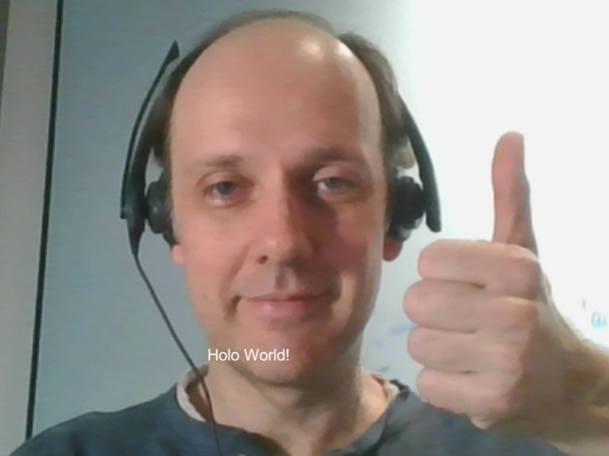

## Setup Instructions

Follow these instructions to deploy and run the application in the emulator:

1. Create Unity project
   - open **Unity**
   - click **Projects** > **New**

   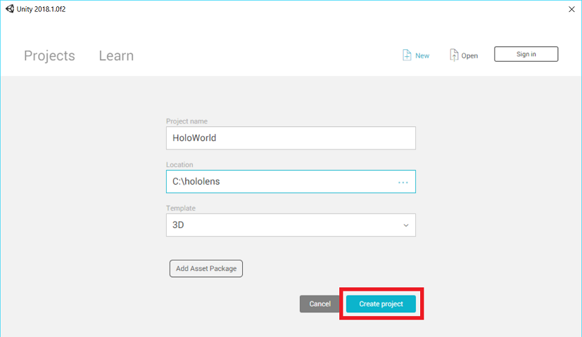

   - for **Project name** type *HoloWorld*
   - for **Location** accept the default or type your own choice
   - for **Template** accept the default **3D**
   - click **Create project**

1. Configure platform
   - menu **File** > **Build Settings...**

   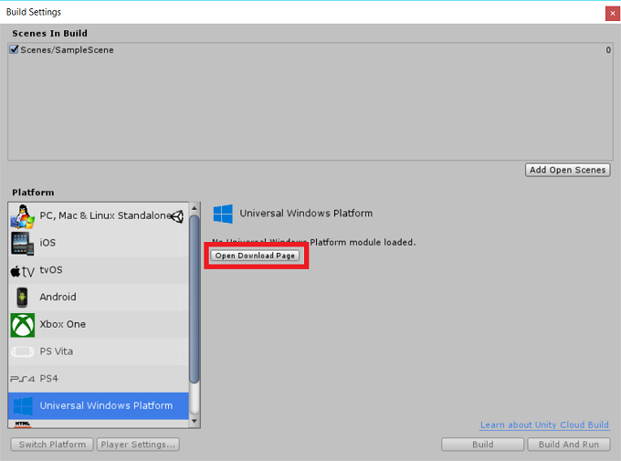

   - in the **Build Settings** dialog, select **Universal Windows Platform**
   - click **Open Download page**
   - save the installer executable to `Downloads`
   - close **Unity**
   - double click the installer executable
   - click **Next** > accept the terms of service > click **Next** > **Next**, select the Unity folder, click **Next** > **Finish**

1. Configure Vuforia
   - start **Unity**
   - click **Projects** > **HoloWorld**
   - menu **File** > **Build Settings...**

   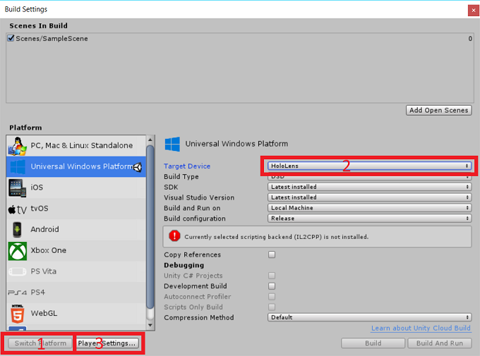

   - in the **Build Settings** dialog, select **Universal Windows Platform**
   - click **Switch Platform**
   - select **HoloLens** for **Target Device**

   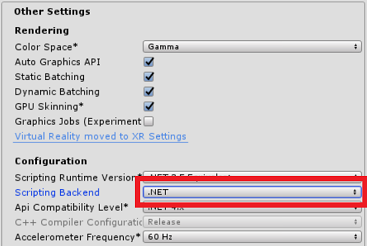

   - click **Player Settings...**
   - in the **Inspector** window that opens, click **Other Settings**
   - select **.NET** for **Scripting Backend**

   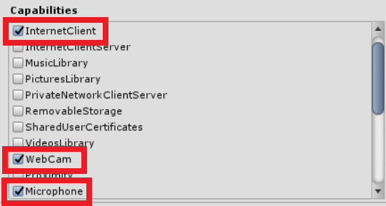

   - click **Publishing Settings**
   - for **Capabilities** check **InternetClient**, **WebCam**, and **Microphone**

   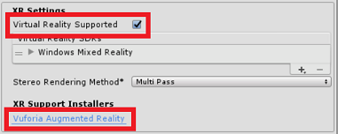

   - click **XR Settings**
   - check **Virtual Reality Supported**
   - click the **Vuforia Augmented Reality** link
   - save the installer executable to `Downloads`
   - close **Unity**
   - double click the installer executable
   - click **Next** > accept the terms of service > click **Next** > **Next**, select the Unity folder, click **Next** > **Finish**
   - start **Unity**
   - click **Projects** > **HoloWorld**
   - menu **File** > **Build Settings...**

   

   - click **Player Settings...**
   - In the **Inspector** window that opens, click **XR Settings**
   - check **Vuforia Augmented Reality**, accept the conditions, click **Finish**

1. Create UI

   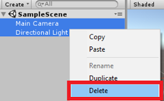

   - In the **Hierarchy** window, select: **MainCamera** and **Directional Light** (Note: Hold down Ctrl key for multi-select)
   - right click: select **Delete**

   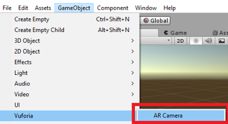

   - right click **SampleScene**
   - click menu option **GameObject** > **Vuforia** > **AR Camera**
   - click **Import**

   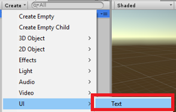

   - in the ***Hierarchy** window on the left, click **Create** > **UI** > **Text**

   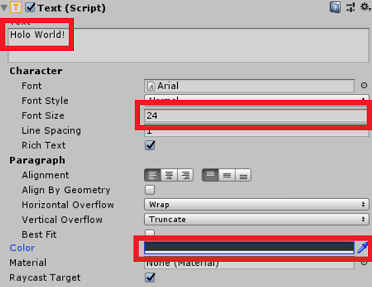

   - in the **Inspector** window on the right, in the **Text (Script)** section, set **Text** to *Holo World!*
   - set **Font Size** to **24**

   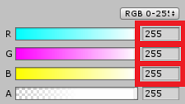

   - click **Color**
   - in the **Color** dialog that opens, set **R**, **G**, and **B** to **255**
   - menu **File** > **Save Scenes**
   - menu **File** > **Save Project**

## Run the demo

   

   - click **Run**. You will see a live camera view overlayed with the words "Holo World!" near the bottom
	 - Note: you may need to widen the display to see the words
