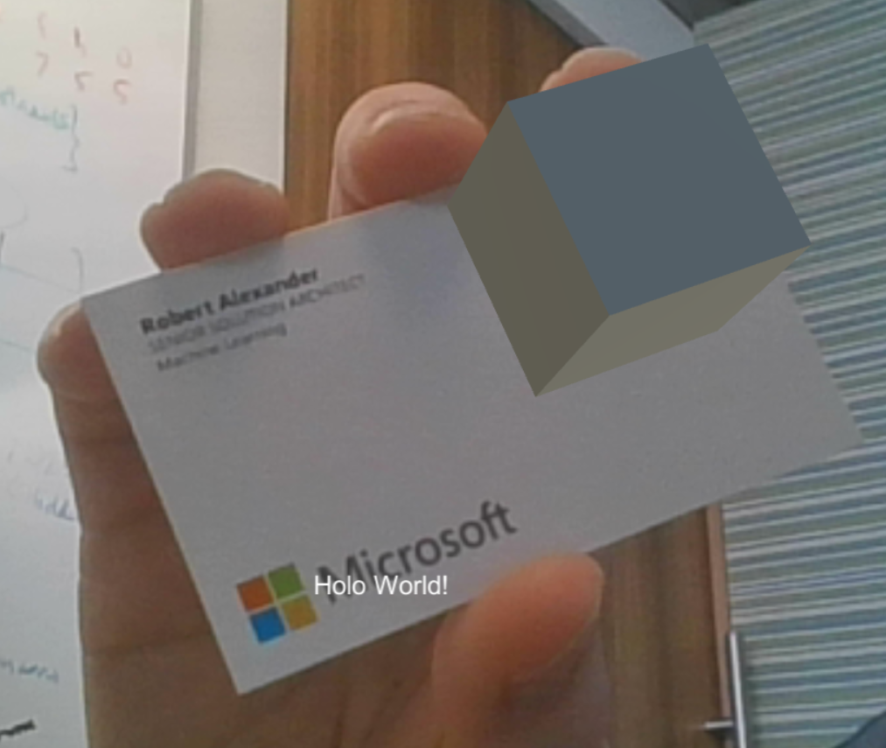

# Demo 2 - Cube

This demo shows how to recognize and track an image, and draw a cube on top of it. When running, it looks like this:

## Setup Instructions

For this demo, we will build upon what we did for the previous demo.

1. Clone this repo into a local download directory. Example:
   - choose a local repo directory, which we'll refer to as `<working-dir>, such as **c:\hololens**
   - open a DOS command prompt
   - type **mkdir `<working-dir>`**
   - type **cd `<working-dir>`**
   - type **git clone https://github.com/Microsoft/reality-augmentation-using-cognitive-services**
   - type **cd reality-augmentation-using-cognitive-services**
   - type **git checkout -b mlads**
   - type **git pull origin mlads**
1. Create Vuforia license key
   - Navigate to [Vuforia Developer Portal](https://developer.vuforia.com)
   - Login
   - Click **Develop** > **License Manager** > **Get Development Key**
   - For **App Name** type **HoloWorld**
   - Accept the terms of agreement
   - Click **Confirm**
   - Under **Name** click **HoloWorld**
   - Make a note of this license key, which we'll refer to as `<vuforia-license-key>` You will need in later in your Unity project.
1. Create Vuforia image database
   - Click **Target Manager** > **Add Database**
   - For **Name** type **HoloWorld**
   - Select **Device**
   - Click **Create**
   - Under **Database** click **HoloWorld**

   

   - Click **Add Target**
   - For **Type** select **Single Image**
   - For **File** click **Browse...**
   - Select **`<working-dir>`\reality-augmentation-using-cognitive-services\images\businesscard.png**
   - Click **Open**
   - For **Width** type **5**
   - For **Name** type **businesscard**
   - Click **Add**
1. Download Vuforia image database

   

   - Click **Download Database (All)**

   

   - Select **Unity Editor**
   - Click **Download**
   - Click **Save As** > **`<working-dir>`\HoloWorld.unitypackage**
   - Click **Save**
1. Import Vuforia image database into Unity project
   - Start **Unity**
   - Click **Projects** > **HoloWorld**

   

   - Menu **Assets** > **Import Package** > **Custom Package...**
   - Browse: **`<working-dir>`\Hololens\HoloWorld.unitypackage**

   

   - Click **Open** > **All** > **Import**

1. Create cube on top of recognized image in Unity project

   

   - Click **AR Camera** > **Open Vuforia configuration**

   

   - For **App License Key** paste your **`<vuforia-license-key>`**

   

   - Select **SampleScene**
   - Click **Create** > **Vuforia** > **Image**

   

   - For **ImageTarget** type **BusinessCardTarget**
   - For **Database** select **HoloWorld**
   - For **Image Target** select **businesscard**

   

   - right click: **BusinessCardTarget**
   - select: **3D Object** > **Cube**

   

   - For **position** > **y** type **0.5**
   - for **scale** > **x** type **0.25**
   - for **scale** > **y** type **0.25**
   - For **scale** > **z** type **0.25**
   - menu **File** > **Save Scenes**
   - menu **File** > **Save Project**

## Run the demo

- click **Run**. If you hold the business card in front of your computer's camera, you will see cube on top of it.
