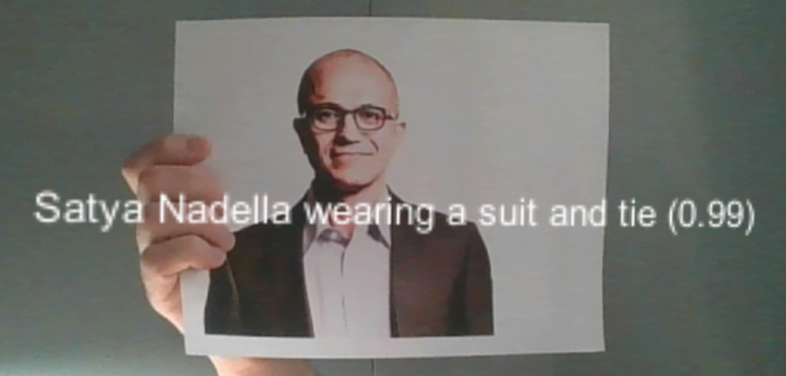
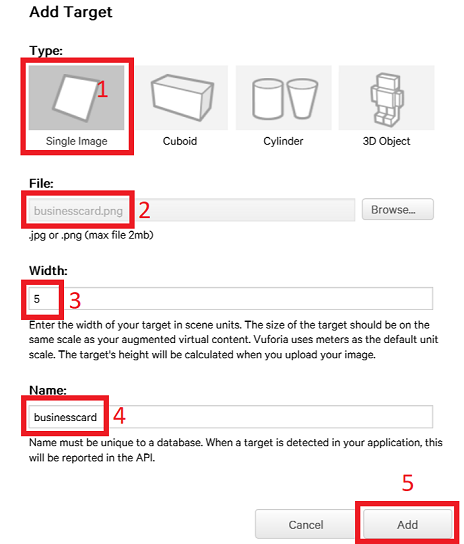
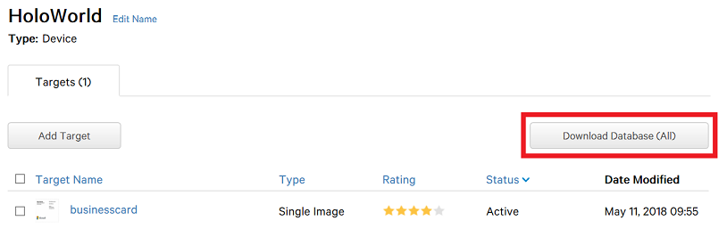
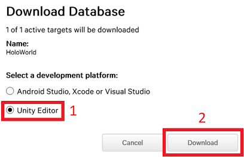
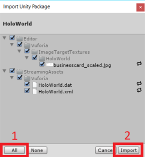
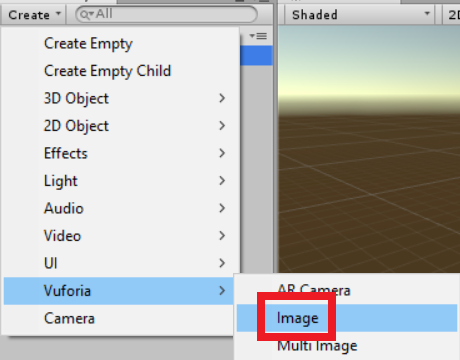
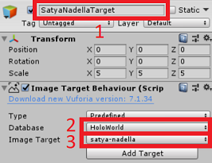
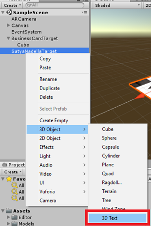
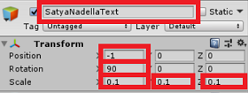

# Demo Three - ImageLabels

This demo builds upon the previous demo by showing how to extract meaningful text about a recognized image from the Computer Vision API and superimpose it on top of your view.

## Setup Instructions

Follow these instructions to deploy the application when using the emulator:

1. Add image to Vuforia image database

   - Navigate to [Vuforia Developer Portal](https://developer.vuforia.com)
   - Login
   - Click **Target Manager**
   - Under **Database** click **HoloWorld**

   

   - Click **Add Target**
   - For **Type** select **Single Image**
   - For **File** click **Browse...**
   - Select **`<working-dir>`\reality-augmentation-using-cognitive-services\03-ImageLabels\images\satya-nadella.jpg**
   - Click **Open**
   - For **Width** type **5**
   - For **Name** type **satya-nadella**
   - Click **Add**

1. Download updated Vuforia image database

   

   - Click **Download Database (All)**

   

   - Select **Unity Editor**
   - Click **Download**
   - Click **Save As** > **`<working-dir>`\HoloWorld.unitypackage**
   - Click **Save** (Note - go ahead and overwrite the existing one)

1. Import updated Vuforia image database into Unity project
   - Start **Unity**
   - Click **Projects** > **HoloWorld**

   

   - Menu **Assets** > **Import Package** > **Custom Package...**
   - Browse: **`<working-dir>`\Hololens\HoloWorld.unitypackage**

   

   - Click **Open** > **All** > **Import**

1. Create image target

   

   - Select **SampleScene**
   - Click **Create** > **Vuforia** > **Image**

   

   - For **ImageTarget** type **SatyaNadellaTarget**
   - For **Database** select **HoloWorld**
   - For **Image Target** select **satya-nadella**

   

   - Right click **SatyaNadellaTarget**
   - Select **3D Object** > **3D Text**

   

   - For **New Text** type **SatyaNadellaText**
   - For **position** > **x** type **-1**
   - For **rotation** > **x** type **90**
   - For **scale** > **x** type **0.1**
   - For **scale** > **y** type **0.1**
   - For **scale** > **z** type **0.1**

   > Checkpoint: Click **Run**. If you hold the picture of Satya Nadella in front of your computer's camera, you will see the default text superimposed on top of it.

1. Copy images to streaming directory

   - Copy **`<working-dir>`\reality-augmentation-using-cognitive-services\03-ImageLabels\images\satya-nadella.jpg** to
  to **`<working-dir>`\HoloWorld\Assets\StreamingAssets**

1. Add scripts for calling Computer Vision API

   - For **Text** remove the default text
   - Create a **Scripts** folder in **`<working-dir>`\HoloWorld\Assets**
   - Copy **`<working-dir>`\reality-augmentation-using-cognitive-services\03-ImageLabels\scripts\ImageUtils.cs** to **`<working-dir>`\HoloWorld\Assets\Scripts**
   - Copy **`<working-dir>`\reality-augmentation-using-cognitive-services\03-ImageLabels\scripts\SetTextSatyaNadella.cs** to **`<working-dir>`\HoloWorld\Assets\Scripts**
   - Copy **`<working-dir>`\reality-augmentation-using-cognitive-services\03-ImageLabels\scripts\TextUtils.cs** to **`<working-dir>`\HoloWorld\Assets\Scripts**
   - Copy **`<working-dir>`\reality-augmentation-using-cognitive-services\03-ImageLabels\scripts\VisionAPIResults.cs** to **`<working-dir>`\HoloWorld\Assets\Scripts**
   - Copy **`<working-dir>`\reality-augmentation-using-cognitive-services\03-ImageLabels\scripts\VisionAPIUtils.cs** to **`<working-dir>`\HoloWorld\Assets\Scripts**

   

   - Click **Add Component** > **Scripts** > **Set Text Satya Nadella**

   > Checkpoint: Click **Run**. If you hold the picture of Satya Nadella in front of your computer's camera, you will see a **404 Not Found** error.

1. Configure scripts for calling Computer Vision API

   - For **Script** double click **SetTextSatyaNadella** (Note - this will open the script in Visual Studio)
   - Right click **VisionAPIUtils** in the code and select **Go To Definition**
   - Replace **YOUR_SUBSCRIPTION_KEY** with your Computer Vision API subscription key
   - Replace **YOUR_BASE_URL** with your Computer Vision API base URL
   - Menu **File** > **Save All**

   - From the Unity Editor
   - Menu **File** > **Save Scenes**
   - Menu **File** > **Save Project**

## Run the demo

   

   - Click **Run**. If you hold the picture of Satya Nadella in front of your computer's camera, you will see information about him superimposed on top of it.
