# Demo Four - Camera

This demo builds upon the previous demo by showing how to take pictures on your device's camera, send it to the Computer Vision API, and overlay information about it on top of it in your view. When running, here's an example of what it might look like:

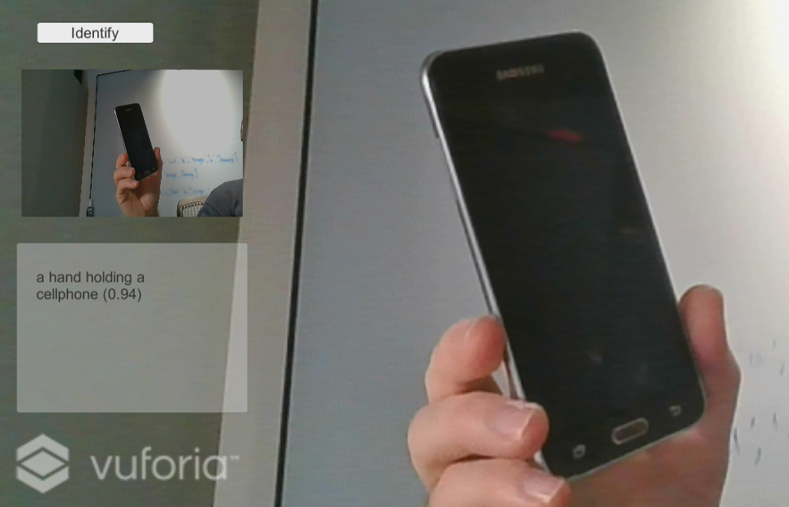

## Setup Instructions

Follow these instructions to deploy the application when using the emulator:

1. Add UI Image

   - Start **Unity**
   - Click **Projects** > **HoloWorld**

   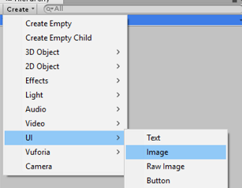

   - Select **SampleScene** > **Create** > **UI** > **Image**

   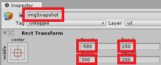

   - For **Image** type **imgSnapshot**
   - For **Pos X** type **-580**
   - For **Pos Y** type **150**
   - For **Width** type **300**
   - For **Height** type **200**

1. Add UI Button

   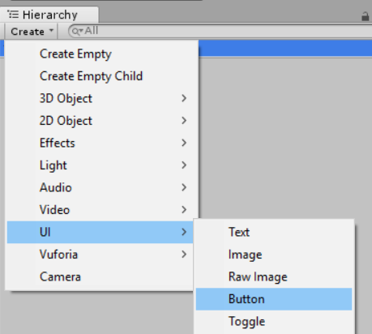

   - Click **SampleScene** > **Create** > **UI** > **Button**

   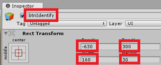

   - Type **btnIdentify**
   - For **Pos X** type **-630**
   - For **Pos Y** type **300**
   - For **Width** type **160**
   - For **Height** type **30**

   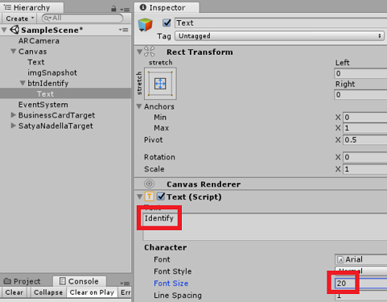

   - Expand **btnIdentify**
   - Select **Text**
   - For **Text** type **Identify**
   - For **Font Size** type **20**

1. Add UI Panel

   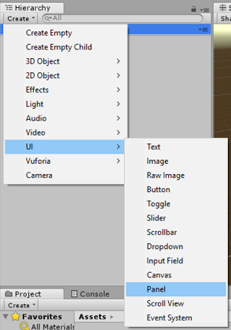

   - Click **SampleScene** > **Create** > **UI** > **Panel**

   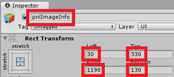

   - Type **pnlImageInfo**
   - For **Left** type **30**
   - For **Top** type **330**
   - For **Right** type **1190**
   - For **Bottom** type **130**

   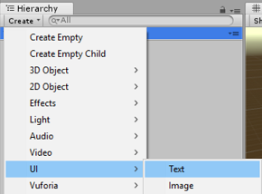

   - Click **SampleScene** > **Create** > **UI** > **Text**

1. Add UI Text

   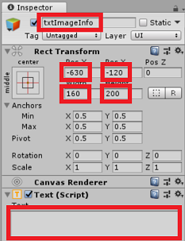

   - Type **txtImageInfo**
   - For **Pos X** type **-630**
   - For **Pos Y** type **-120**
   - For **Width** type **160**
   - For **Height** type **200**
   - For **Text** remove the default text **Next Text**
   - For **Font Size** set to **20**

  > Checkpoint: Click **Run**. For now you will see the layout of the new UI components. The won't do anything yet, but that's in the next section, where we will configure scripts so that when you click the **Identify** button your device's camera takes a picture, sends the image to the Computer Vision API, and the results are displayed. *Note:* you may need to click **Maximize On Play** to see the components.

1. Add scripts
   - Copy **`<working-dir>`\reality-augmentation-using-cognitive-services\04-Camera\scripts\ButtonHandler.cs** to **`<working-dir>`\HoloWorld\assets\Scripts**
   - Copy **`<working-dir>`\reality-augmentation-using-cognitive-services\04-Camera\scripts\CameraUtils.cs** to **`<working-dir>`\HoloWorld\assets\Scripts**
   - Copy **`<working-dir>`\reality-augmentation-using-cognitive-services\04-Camera\scripts\SetImageLabels.cs** to **`<working-dir>`\HoloWorld\assets\Scripts**

1. Hook up scripts

   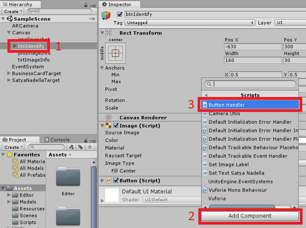

   - Click **btnIdentify**
   - Click **Add Component** > **Scripts** > **Button Handler**

    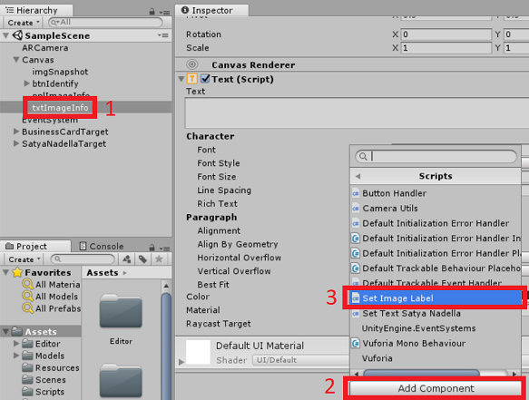

   - Click **txtImageInfo**
   - Click **Add Component** > **Scripts** > **Set Image Label**
   - Menu **File** > **Save All**

## Run the demo

  

  - Click **Run**. If you hold your cellphone in front of your computer's camera and the click the **Identify** button and it will use the device camera to take a picture, send it to the Computer Vision API, and overlay information about it on top of it in your view.
