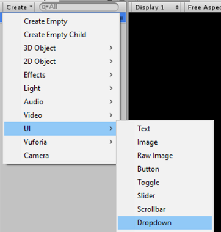
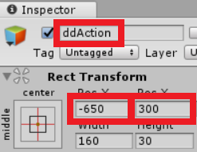
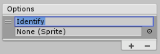
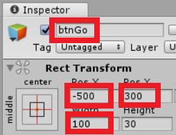
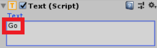

# Demo Four - Camera

This demo builds upon the previous demo by showing how to take pictures on your device's camera, send it to the Computer Vision API, and overlay information about it on top of it in your view. When running, here's an example of what it might look like:

## Setup Instructions

Follow these instructions to deploy the application when using the emulator:

1. Add UI Dropdown

   - Start **Unity**
   - Click **Projects** > **HoloWorld**
   - Select **SampleScene** > **Create** > **UI** > **Dropdown**
   
   
   
   - Rename **Dropdown** to **ddAction**. Click *enter* to save the name change.
   - For **Pos X** type **-650**
   - For **Pos Y** type **300**
   
   
   
   - Remove default options
   - Add option **Identify**
   
   
   
1. Add UI Button

   - Click **SampleScene** > **Create** > **UI** > **Button**

   

   - Rename **Button** to **btnGo**. Click *enter* to save the name change.
   - For **Pos X** type **-500**
   - For **Pos Y** type **300**
   - For **Width** type **100**

   
   
   - Expand **btnGo**
   - Select **Text**
   - For **Text** type **Go**

   

1. Add UI Image

   - Select **SampleScene** > **Create** > **UI** > **Image**

   

   - Rename **Image** to **imgSnapshot**. Click *enter* to save the name change.
   - For **Pos X** type **-580**
   - For **Pos Y** type **150**
   - For **Width** type **300**
   - For **Height** type **200**

   

1. Add UI Panel

   - Click **SampleScene** > **Create** > **UI** > **Panel**

   
   
   - Rename **Panel** to **pnlImageInfo**. Click *enter* to save the name change.
   - For **Left** type **30**
   - For **Top** type **330**
   - For **Right** type **1190**
   - For **Bottom** type **130**

   

1. Add UI Text

   - Click **SampleScene** > **Create** > **UI** > **Text**

   

   - Rename **Text** to **txtImageInfo**. Click *enter* to save the name change.
   - For **Pos X** type **-630**
   - For **Pos Y** type **-120**
   - For **Width** type **160**
   - For **Height** type **200**
   - For **Text** remove the default text **New Text**
   - For **Font Size** set to **20**   

   

   > Checkpoint: Click **Run**. For now you will see the layout of the new UI components. This won't do anything yet, but in the next section we will configure scripts so that when you click the **Identify** button your device's camera takes a picture, sends the image to the Computer Vision API, and the results are displayed. *Note:* you may need to click **Maximize On Play** to see the components.

1. Add scripts
   - Copy **`<working-dir>`\reality-augmentation-using-cognitive-services\04-Camera\scripts\ButtonHandler.cs** to **`<working-dir>`\HoloWorld\Assets\Scripts**
   - Copy **`<working-dir>`\reality-augmentation-using-cognitive-services\04-Camera\scripts\CameraUtils.cs** to **`<working-dir>`\HoloWorld\Assets\Scripts**
   - Copy **`<working-dir>`\reality-augmentation-using-cognitive-services\04-Camera\scripts\SetImageLabels.cs** to **`<working-dir>`\HoloWorld\Assets\Scripts**

1. Hook up scripts

   - Click **btnGo**
   - Click **Add Component** > **Scripts** > **Button Handler**

   
   
   - Click **txtImageInfo**
   - Click **Add Component** > **Scripts** > **Set Image Label**
   - Menu **File** > **Save Scenes**
   - Menu **File** > **Save Project**

   

## Run the demo

  

  - Click **Run**. If you hold your cellphone in front of your computer's camera and click the **Identify** button, it will use the device camera to take a picture, send it to the Computer Vision API, and overlay information about it on top of it in your view.
