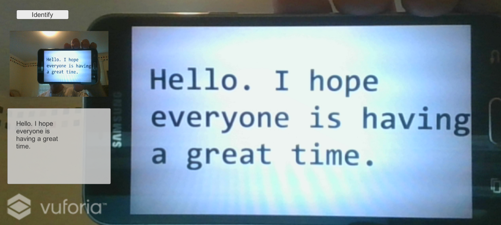

# Demo Five - OCR

This demo builds upon the previous demo by showing how to call the Computer Vision API to recognize text in images using Optical Character Recognition (OCR). When running, it looks like this:



## Setup Instructions

Follow these instructions to deploy the application when using the emulator:

1. Add scripts
   - Copy **`<working-dir>`\reality-augmentation-using-cognitive-services\05-OCR\scripts\OCRAPIResults.cs** to **`<working-dir>`\HoloWorld\assets\Scripts**

1. Edit scripts
   - Edit **`<working-dir>`\HoloWorld\assets\Scripts\SetImageLabels.cs** by commenting out the call to **MakeAnalysisRequest** and adding a new line below it that calls **MakeOCRRequest** as follows:
   ```
   //StartCoroutine(VisionAPIUtils.MakeAnalysisRequest(bytes, "txtImageInfo", typeof(Text)));
   StartCoroutine(VisionAPIUtils.MakeOCRRequest(bytes, "txtImageInfo", typeof(Text)));
   ```
   -Edit **`<working-dir>`\HoloWorld\assets\Scripts\VisionAPIUtils.cs** by adding this const at the top:
   ```
   const string VISION_API_OCR_URL = "https://eastus.api.cognitive.microsoft.com/vision/v2.0/ocr";
   ```
   and by adding a new function called **MakeOCRRequest** at the bottom of the **VisionAPIUtils** class:
   ```
   public static IEnumerator MakeOCRRequest(byte[] bytes, string textComponent, Type type)
   {
       var headers = new Dictionary<string, string>()
       {
           {"Ocp-Apim-Subscription-Key", VISION_API_SUBSCRIPTION_KEY },
           {"Content-Type","application/octet-stream"}
       };
       string requestParameters = "visualFeatures=Description&language=en";
       string uri = VISION_API_OCR_URL + "?" + requestParameters;
	   if ( (bytes != null) && (bytes.Length > 0) ) {
		   WWW www = new WWW(uri, bytes, headers);
		   yield return www;

		   if (www.error != null)
		   {
			   TextUtils.setText(www.error, textComponent, type);
		   }
		   else
		   {
			   OCRAPIResults results = JsonUtility.FromJson<OCRAPIResults>(www.text);
			   TextUtils.setText(results.ToString(), textComponent, type);
		   }
	   }
   }
   ```
   - Menu **File** > **Save All**

   - From the Unity Editor
   - Menu **File** > **Save Scenes**
   - Menu **File** > **Save Project**

## Run the demo

  

  - Click **Run**. If you hold some text in front of your computer's camera and click the **Identify** button, you will see the text extracted from the image. As an example, you can use a printout or a phone capture of the text image found at **`<working-dir>`\reality-augmentation-using-cognitive-services\05-OCR\images\text.png**.
