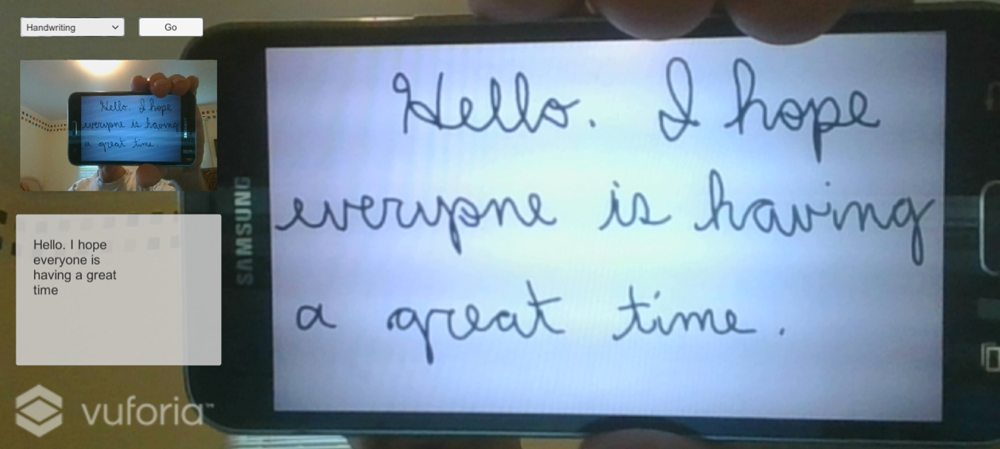

# Demo Six - Handwriting

This demo builds upon the previous demo by showing how to call the Vision API on a text image and recognize handwriting. When running, it looks like this:



## Setup Instructions

Follow these instructions to deploy the application when using the emulator:

1. Add scripts
   - Copy **`<working-dir>`\reality-augmentation-using-cognitive-services\07-Handwriting\scripts\HandwritingAPIResults.cs** to **`<working-dir>`\HoloWorld\assets\Scripts**

1. Edit scripts
   - Edit **`<working-dir>`\HoloWorld\assets\Scripts\SetImageLabels.cs** by commenting out the call to **MakeTranslationRequest** and adding a new line below it that calls **MakeHandwritingRequest** as follows:
   ```
   //StartCoroutine(VisionAPIUtils.MakeTranslationRequest(bytes, "txtImageInfo", typeof(Text)));
   StartCoroutine(VisionAPIUtils.MakeHandwritingRequest(bytes, "txtImageInfo", typeof(Text)));
   ```
   -Edit **`<working-dir>`\HoloWorld\assets\Scripts\VisionAPIUtils.cs** by adding this at the top:
   ```
   const string VISION_API_RECOGNIZETEXT_URL = "https://eastus.api.cognitive.microsoft.com/vision/v2.0/recognizeText";
   ```

   -Add a new function called **MakeHandwritingRequest** at the bottom of the VisionAPIUtils class:
   ```
    public static IEnumerator MakeHandwritingRequest(byte[] bytes, string textComponent, Type type)
    {
        var headers = new Dictionary<string, string>() {
            {"Ocp-Apim-Subscription-Key", VISION_API_SUBSCRIPTION_KEY },
            {"Content-Type","application/octet-stream"}
        };
        string requestParameters = "mode=Handwritten";
        string uri = VISION_API_RECOGNIZETEXT_URL + "?" + requestParameters;
		if ( (bytes != null) && (bytes.Length > 0) ) {
			WWW www = new WWW(uri, bytes, headers);
			yield return www;

			if (www.error != null)
			{
				TextUtils.setText(www.error, textComponent, type);
			}
			else
			{
				string operationLocation = www.responseHeaders["Operation-Location"];
				var headers2 = new Dictionary<string, string>() {
						{"Ocp-Apim-Subscription-Key", VISION_API_SUBSCRIPTION_KEY }
					};
				System.Threading.Thread.Sleep(1000);
				WWW www2 = new WWW(operationLocation, null, headers2);
				yield return www2;

				if (www2.error != null)
				{
					TextUtils.setText(www.error, textComponent, type);
				}
				else
				{
					HandwritingAPIResults results = JsonUtility.FromJson<HandwritingAPIResults>(www2.text);
					TextUtils.setText(results.ToString(), textComponent, type);
				}
			}
		}
    }
   ```
   - Menu **File** > **Save All**

   - From the Unity Editor
   - Menu **File** > **Save Scenes**
   - Menu **File** > **Save Project**

## Run the demo

  

  - Click **Run**. If you hold some handwritten text in front of your computer's camera and click the **Identify** button, you will see the recognized text extracted from the image. As an example, you can use a printout or a phone capture of the text image found at **`<working-dir>`\reality-augmentation-using-cognitive-services\07-Handwriting\images\cursive.png**.
