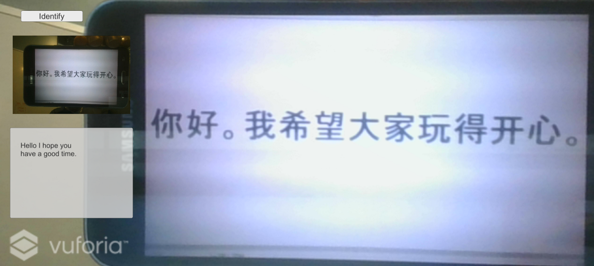

# Demo Six - Translate

This demo builds upon the previous demo by showing how to call the Translation API on text recognized in an image using Optical Character Recognition (OCR). When running, it looks like this:



## Setup Instructions

Follow these instructions to deploy the application when using the emulator:

1. Add scripts
   - Copy **`<working-dir>`\reality-augmentation-using-cognitive-services\06-Translate\scripts\TranslationAPIResults.cs** to **`<working-dir>`\HoloWorld\assets\Scripts**

1. Edit scripts
   - Edit **`<working-dir>`\HoloWorld\assets\Scripts\SetImageLabels.cs** by commenting out the call to **MakeOCRRequest** and adding a new line below it that calls **MakeTranslationRequest** as follows:
   ```
   //StartCoroutine(VisionAPIUtils.MakeOCRRequest(bytes, "txtImageInfo", typeof(Text)));
   StartCoroutine(VisionAPIUtils.MakeTranslationRequest(bytes, "txtImageInfo", typeof(Text)));
   ```
   -Edit **`<working-dir>`\HoloWorld\assets\Scripts\VisionAPIUtils.cs** by adding these consts at the top:
   ```
   const string TRANSLATE_API_SUBSCRIPTION_KEY = "YOUR-SUBSCRIPTION-KEY";
   const string TRANSLATE_API_URL = "https://api.cognitive.microsofttranslator.com/translate";
   ```
   -Replace **YOUR-SUBSCRIPTION-KEY** with your Translation API subscription key.

   -Add a new function called **MakeTranslationRequest** at the bottom:
   ```
   public static IEnumerator MakeTranslationRequest(byte[] bytes, string textComponent, Type type)
   {
       var headers = new Dictionary<string, string>() {
           {"Ocp-Apim-Subscription-Key", VISION_API_SUBSCRIPTION_KEY },
           {"Content-Type","application/octet-stream"}
       };
       string requestParameters = "visualFeatures=Description&language=en";
       string uri = VISION_API_OCR_URL + "?" + requestParameters;
       WWW www = new WWW(uri, bytes, headers);
       yield return www;

       if (www.error != null)
       {
           TextUtils.setText(www.error, textComponent, type);
       }
       else
       {
           OCRAPIResults results = JsonUtility.FromJson<OCRAPIResults>(www.text);
           string text = results.ToString();
           var requestBody = "[{\"Text\":\"" + text + "\"}]";
           byte[] textBytes = System.Text.Encoding.ASCII.GetBytes(requestBody.ToCharArray());
           var headers2 = new Dictionary<string, string>() {
               {"Ocp-Apim-Subscription-Key", TRANSLATE_API_SUBSCRIPTION_KEY},
               {"Content-Type","application/json"}
           };
           string requestParameters2 = "to=zh-Hans&api-version=3.0";
           string uri2 = TRANSLATE_API_URL + "?" + requestParameters2;
           WWW www2 = new WWW(uri2, textBytes, headers2);
           yield return www2;

           if (www2.error != null)
           {
               TextUtils.setText(www2.error, textComponent, type);
           }
           else
           {
               string json = www2.text.TrimStart('[').TrimEnd(']');
               TranslationAPIResults results2 = JsonUtility.FromJson<TranslationAPIResults>(json);
               TextUtils.setText(results2.ToString(), textComponent, type);
           }
       }
   }
   ```

## Run the demo

  

  - Click **Run**. If you hold some text in front of your computer's camera and click the **Identify** button, you will see the text extracted from the image and translated into Chinese. As an example, you can use a printout or a phone capture of the text image found at **`<working-dir>`\reality-augmentation-using-cognitive-services\06-Translate\images\text.png**.